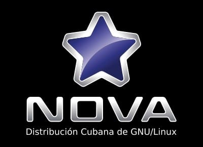

## Hi there 👋
My name is Dairelys García Rivas, and I'm also known as __Hydra__.

- 🔭 I’m currently working as a freelancer on different projects.
- 🌱 I’m currently learning Django + Python, while I continue learning and working with Javascript, Node.JS, Vue.JS, Angular among others.
- 👯 I’m looking to collaborate on bigger projects using the technologies I already know and hoping to find new challenges.
- 🤔 I’m looking for help with Docker, it's something I'm still trying to master.
- 💬 Ask me about Vue.js, Node.js, Angular, LaTeX, Java, Bash, I'm always eager to help and learn :D.
- ⚡ Fun fact: I'm a full nerd, passionate about computers and programming. I love reading and watching adaptations from adventure and fantasy books: Harry Potter, Game of Thrones, Lord of the Rings, Star Wars.....

# Work experience

## Software developer
### (Freelancer) (01/2024 - Present)

## Software developer
### (LEIL Storage) (01/2023 - 06/2023)

## Software developer
### (LizardFS) (11/2021 - 12/2022)

## Software developer
### (Cuban engineer) (06/2019 - 11/2022)

## International relations officer
### (University of Informatics Sciences) (01/2017 - 08/2019)

## Software developer / Project leader
### (University of Informatics Sciences) (09/2012 - 12/2016)

# Portfolio of projects I have worked with

## Nova
### (Bash, Git)

## Cuban engineer
### (Angular, CSS, JavaScript, Spring Boot)

## LizardFS
### (Docker, Vue, Javascript)

## Sinterit NILS 480 3D printer
### (Vue, Javascript, CSS)

## Imagined earth
### (Ionic)

## BeFit
### (Django, Vue, Docker, CSS)

